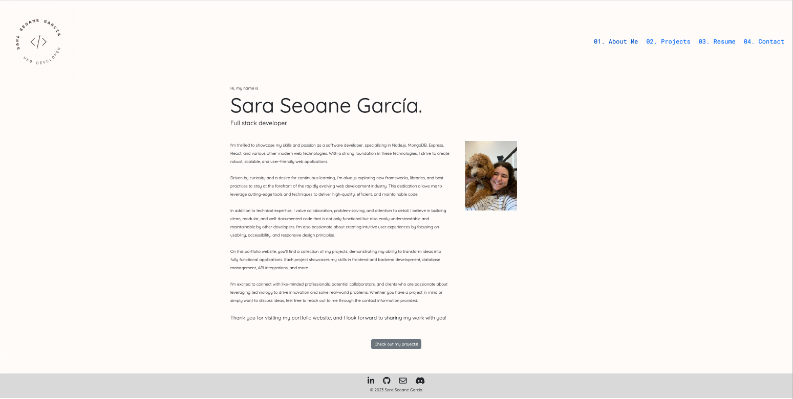
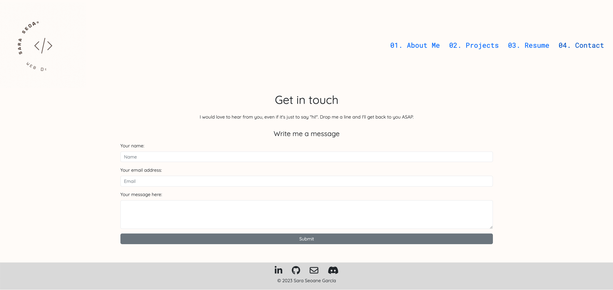

# My Portfolio

## Description

This is my portfolio! Check out my projects by accessing the deployed link 👇

## Table of contents

- [Deployed application](#deployed-application)
- [Screenshots](#screenshots)
- [Credits](#credits)
- [License](#license)

## Deployed application

[https://sarasg89.github.io/replicating-portfolio/](https://sarasg89.github.io/replicating-portfolio/)

## Screenshots

### Home page

### Contact me page

## Credits

In order to be able to send emails from the contact form, I used [EmailJS](https://www.emailjs.com/) and followed this [tutorial](https://www.youtube.com/watch?v=bMq2riFCF90&t=8s&ab_channel=ChaooCharles). I then run into some problems with dotenv not working with Webpack v5 so I had to create a server to hide my API keys. I followed this [article](https://www.freecodecamp.org/news/how-to-create-a-react-app-with-a-node-backend-the-complete-guide/) from freeCodeCamp.Lastly, I was having issues with the API not reading the .env file so I changed the execution path as recommended in [this](https://stackoverflow.com/questions/42335016/dotenv-file-is-not-loading-environment-variables) Stack Overflow post.

[This](https://stackoverflow.com/questions/41938718/how-to-download-files-using-axios) post on Stack Overflow helped me figure out how to download files using Axios.

In order to get the modal to work with React, I had to read some articles that explained how to write a function to show/hide the modal. I found [this](https://react-bootstrap.github.io/components/modal/) one especially helpful.

I used the same [site](https://react-bootstrap.github.io/components/offcanvas/) to work out the off-canvas navbar.

Because I wanted to make the contact form actually functional I ran into several problems during deployment when I initially tried to deploy the whole app to Heroku. In the end I had to take the following steps:

1. Remove the server/client folder structure from main and leave only the contents of the client folder (public, src, package.json, etc.)
2. I was finally able to deploy the app with GitHub Pages but now the contact form and resume download were not working because they previously relied on a separate node server
3. I created a new [repository](https://github.com/sarasg89/portfolio-server) for the server and deployed it to [Heroku](https://dashboard.heroku.com/apps/ssg-portfolio-server)
4. I updated the API calls in the client to point to the Heroku server
5. I enable CORS support on the Heroku server so that GitHub Pages could access it. I achieved by following [this](https://stackabuse.com/handling-cors-with-node-js/) tutorial

## License

MIT License

Copyright (c) 2023 sarasg89

Permission is hereby granted, free of charge, to any person obtaining a copy of this software and associated documentation files (the "Software"), to deal in the Software without restriction, including without limitation the rights to use, copy, modify, merge, publish, distribute, sublicense, and/or sell copies of the Software, and to permit persons to whom the Software is furnished to do so, subject to the following conditions:

The above copyright notice and this permission notice shall be included in all copies or substantial portions of the Software.

THE SOFTWARE IS PROVIDED "AS IS", WITHOUT WARRANTY OF ANY KIND, EXPRESS OR IMPLIED, INCLUDING BUT NOT LIMITED TO THE WARRANTIES OF MERCHANTABILITY, FITNESS FOR A PARTICULAR PURPOSE AND NONINFRINGEMENT. IN NO EVENT SHALL THE AUTHORS OR COPYRIGHT HOLDERS BE LIABLE FOR ANY CLAIM, DAMAGES OR OTHER LIABILITY, WHETHER IN AN ACTION OF CONTRACT, TORT OR OTHERWISE, ARISING FROM, OUT OF OR IN CONNECTION WITH THE SOFTWARE OR THE USE OR OTHER DEALINGS IN THE SOFTWARE.
